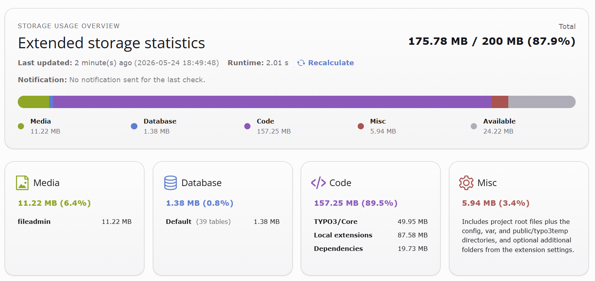
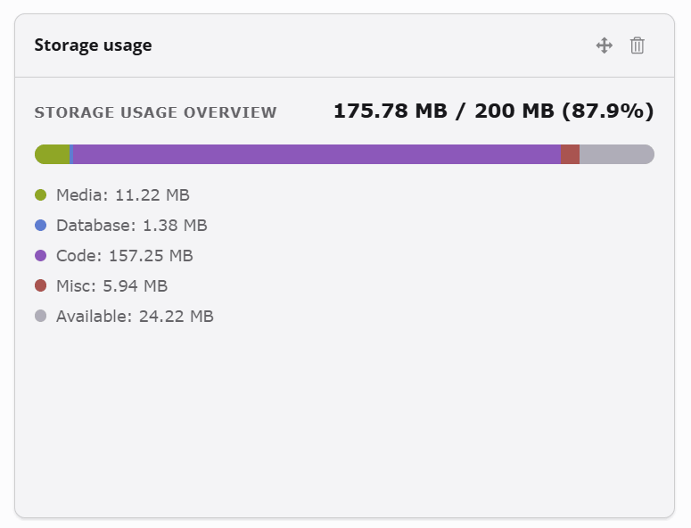

# EXT:size

## Intro

TYPO3 CMS extension to display TYPO3 CMS storage usage information in the backend.

`size` gives editors and administrators a fast overview of project storage usage in TYPO3.



## Features

- backend module with storage distribution for `Media`, `Database`, `Code`, and `Misc`
- dashboard widget and backend toolbar item based on the same snapshot data
- optional history with 31 daily, 12 weekly, and 12 monthly aggregated checkpoints
- table with the 10 largest FAL files, including path and usage count
- CLI command and TYPO3 Scheduler support via `size:refresh`
- configurable total storage limit with percentage display
- warning and full email notifications
- PSR-14 extensibility for collected paths and snapshot manipulation



For PSR-14 events, payload details, and a listener example, see [Documentation/EventListeners.md](Documentation/EventListeners.md).

## Requirements

- PHP `^8.2`
- TYPO3 `^13.4` or `^14.3`
- TYPO3 system extensions "dashboard" and "scheduler" for full feature usage

## Installation

Install the extension via Composer:

```bash
composer require t3/size
```

After installation:

1. activate the extension in TYPO3 if required by your setup
2. execute the database/schema updates suggested by TYPO3
3. optionally add `size:refresh` as a Scheduler job

The extension provides the Symfony command:

```bash
php vendor/bin/typo3 size:refresh
```

Use this command manually or in TYPO3 Scheduler jobs to refresh the size overview.

## Configuration

### `maximumTotalStorage`

Defines the expected total capacity for the measured project storage and enables percentage display in the backend.

Examples:

- `250 MB`
- `1 GB`
- `1.5 GB`

If set, the total section is rendered like `Total: 165.32 MB / 250 MB (66.1%)`.

If more than `50%` of the configured limit is still free, the dashboard/module bar switches to a hybrid display: used categories stay readable, while the `Available` segment is explicitly marked as compressed. The history chart keeps the configured limit as a separate reference line when values remain far below that limit.

### `warningNotificationRecipients`

Comma- or line-separated email addresses that receive a warning mail when the measured total is above `90%` and below `100%` of `maximumTotalStorage`.

### `fullNotificationRecipients`

Comma- or line-separated email addresses that receive a full mail when the measured total is at or above `100%` of `maximumTotalStorage`.

### `additionalMiscFolders`

Comma- or line-separated relative project paths that should be measured as additional `Misc` rows.

Examples:

- `packages`
- `public/uploads`
- `Build/cache`

Configured paths must point into the TYPO3 project directory.

### `enableHistory`

Default: enabled.

Stores aggregated checkpoints for `Media`, `Database`, `Code`, `Misc`, and `Total` in `sys_registry` during recalculation. The extension keeps:

- 31 daily checkpoints
- 12 completed ISO weeks
- 12 completed calendar months

If disabled, no history entries are written and the week/month comparison UI is hidden.
